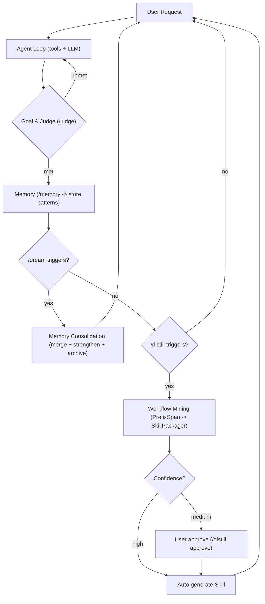

# Axiom

> Built upon **[CoreCoder](https://github.com/he-yufeng/CoreCoder)** — the minimalist Claude Code reimplementation in Python (~1,400 lines).
>
> Axiom inherits CoreCoder's clean agent loop, tool system, streaming, and context compression, then layers on **five cognitive subsystems** that transform it from a teaching artifact into a production-grade autonomous coding agent.

[中文](README_CN.md)

[](LICENSE)

**512,000 lines of TypeScript → ~8,500 lines of Python.**

CoreCoder stripped Claude Code down to the load-bearing walls. Axiom rebuilds the upper floors — memory, skills, code analysis, dream consolidation, goal judgment — into a **self-aware coding agent architecture**.

This is not another AI coding tool. It's a **blueprint** — the [nanoGPT](https://github.com/karpathy/nanoGPT) of autonomous coding agents. Read it, fork it, build your own.

---

```
$ axiom -m kimi-k2.5

You > /analyze src/ | grep hotspot

  > Analyzing src/...
  > Complexity hotspots:
  >   parse_config (src/config.py:42) complexity=12

You > /goal Refactor parse_config to complexity < 8, all tests pass

  Goal set: Refactor parse_config to complexity < 8, all tests pass
    1. parse_config cyclomatic complexity < 8
    2. All existing tests pass
    3. No new lint errors

You > /judge

  ✓ Goal met! (85% confidence)
    • Found 4 passed in 2.1s
    • parse_config complexity: 14 → 6
```

### Why "Axiom"?

> An **axiom** is a statement that is taken to be true, serving as a starting point for further reasoning.

This project is exactly that — the foundational layer you build your autonomous coding agent on top of. Start with the running code, then extend it into whatever direction your work needs.

---

## What Makes This Different

CoreCoder distilled Claude Code's 7 core architectural patterns into a readable ~1,400 lines. Axiom extends that foundation with **5 cognitive subsystems** (~6,200 lines) that turn a stateless agent loop into a self-improving system:

| Layer | System | Purpose | Lines |
|---|---|---|---|
| 🧠 **Memory** | `memory/` (5 files) | Multi-layer retention — episodic, semantic, procedural | 639 |
| 🔧 **Skills** | `skills/` (6 files) | Pluggable tool extensions — discover, load, generate, validate | 967 |
| 📐 **Code Analysis** | `code_analysis/` (7 files) | AST parser, call graph, complexity metrics, dependency graph | 2,063 |
| 🌙 **Dream & Distill** | `dream_distill/` (5 files) | Memory consolidation + workflow pattern mining → auto skill generation | 1,167 |
| 🎯 **Goal & Judge** | `goal/` (5 files) | Actor-Critic architecture — set goals, evaluate with independent Judge + VerifierChain | 1,316 |
| **Core Infrastructure** | `tools/`, `agent.py`, `cli.py`, … | Agent loop, parallel execution, streaming, context compression | ~2,400 |

### The Cognitive Loop

Unlike a simple request-response agent, Axiom implements a **closed cognitive loop**:



## Install

### Option 1: Conda (recommended)

```bash
# Clone the repository
git clone https://github.com/YOUR_USERNAME/axiom.git
cd axiom

# Create environment from environment.yml (exact version lock)
conda env create -f environment.yml

# Or alternatively from requirements_conda.txt
conda create --name axiom --file requirements_conda.txt

# Activate it
conda activate axiom
```

### Option 2: Minimal environment (from history)

If you prefer a cleaner, platform-agnostic setup, create a minimal conda environment first, then install the core dependencies:

```bash
conda create -n axiom python=3.11
conda activate axiom
pip install openai httpx pydantic python-dotenv rich tqdm ipykernel
```

---

Pick your model — any OpenAI-compatible API works:

```bash
# Kimi K2.5
export OPENAI_API_KEY=your-key OPENAI_BASE_URL=https://api.moonshot.ai/v1
python -m axiom.cli -m kimi-k2.5

# Claude (via OpenRouter)
export OPENAI_API_KEY=your-key OPENAI_BASE_URL=https://openrouter.ai/api/v1
python -m axiom.cli -m anthropic/claude-opus-4-6

# DeepSeek / Qwen / Ollama … same as any OpenAI-compatible endpoint
```

## Architecture

```
axiom/
├── cli.py              REPL + all commands               582 lines
├── agent.py            Agent loop + subsystems            170 lines
├── llm.py              Streaming client + retry           327 lines
├── context.py          3-layer compression                196 lines
├── session.py          Save/resume                         90 lines
├── prompt.py           System prompt                       33 lines
├── config.py           Env config                          58 lines
│
├── memory/             🧠 Multi-layer memory system
│   ├── models.py        MemoryItem, MemoryType             100 lines
│   ├── manager.py       remember / recall / forget         235 lines
│   ├── persistence.py   JSON per-item file storage         124 lines
│   └── search.py        TF-heuristic semantic search       148 lines
│
├── skills/             🔧 Pluggable skill system
│   ├── loader.py        Discover from disk, pip, builtins  187 lines
│   ├── registry.py      In-memory skill registry            57 lines
│   ├── manager.py       Install / remove / list             178 lines
│   ├── generator.py     Validate + generate from template  266 lines
│   ├── spec.py          Data models                         24 lines
│   └── builtin/         url_fetch, json_tool, file_stats   219 lines
│
├── code_analysis/      📐 AST-based static analysis
│   ├── ast_parser.py    Function / class / import extract   374 lines
│   ├── call_graph.py    Directed graph, BFS shortest path   197 lines
│   ├── dependency_graph.py  Module deps, cycle detection    308 lines
│   ├── metrics.py       McCabe + Cognitive complexity       349 lines
│   ├── refactor.py      Scope-aware rename + extract        339 lines
│   └── reporter.py      AnalysisResult, Markdown reports    236 lines
│
├── dream_distill/       🌙 Memory consolidation + workflow mining
│   ├── dream.py         MemoryConsolidator, SmartForgetter  259 lines
│   ├── distill.py       PatternMiner, PrefixSpan, SkillPkg  508 lines
│   ├── schemas.py       DreamReport, WorkflowPattern        133 lines
│   └── triggers.py      AutoTrigger (should_dream/distill)  102 lines
│
├── goal/               🎯 Goal & Judge (Actor-Critic)
│   ├── goal.py          GoalManager — set, refine, track    226 lines
│   ├── judge.py         Judge — independent LLM evaluator   394 lines
│   ├── verifier.py      VerifierChain — test + file + syntax 338 lines
│   └── schemas.py       Goal, JudgeVerdict, VerdictItem     148 lines
│
├── tools/               🔧 Agent tool implementations
│   ├── analyze.py       AnalyzeTool (code_analysis bridge)  266 lines
│   ├── bash.py          Shell + safety + cd tracking        115 lines
│   ├── edit.py          Search-replace + diff                89 lines
│   ├── read/write/glob/grep/agent   File ops + sub-agent    269 lines
│   └── base.py          Tool base class                      27 lines
│
│   TOTAL                                                   ~8,500 lines
```

## Commands

```
General:
  /help             Show this help
  /reset            Clear conversation history
  /model            Show current model
  /model <name>     Switch model mid-conversation
  /tokens           Show token usage
  /compact          Compress conversation context
  /save             Save session to disk
  /sessions         List saved sessions
  /diff             Show files modified this session

Cognitive:
  /memory           Show memory statistics
  /memory <query>   Search memories
  /dream            Run memory consolidation (dream)
  /distill          Mine & package workflow skills
  /distill approve <name>  Approve a medium-confidence pattern

Analysis:
  /analyze [path]   AST-based code analysis
  /skills           List loaded skills & tools

Task:
  /goal             Show current goal
  /goal <desc>      Set a task completion goal
  /goal refine      Decompose goal into checkable sub-conditions
  /goal clear       Clear the current goal
  /judge            Evaluate whether the goal is truly met

Session:
  quit              Exit
```

## Use as a Library

```python
from axiom import Agent, LLM

llm = LLM(model="kimi-k2.5", api_key="your-key", base_url="https://api.moonshot.ai/v1")
agent = Agent(llm=llm)

# Everything is wired up automatically:
#   agent.memory_manager  — multi-layer memory
#   agent.dream_engine    — consolidation + distillation
#   agent.goal_engine     — set by CLI for /goal and /judge

response = agent.chat("find all TODO comments and list them")
```

## How It Compares

| | Claude Code | CoreCoder | **Axiom** |
|---|---|---|---|
| Code | 512K lines (closed) | ~1,400 lines | **~8,500 lines** |
| Agent loop | ✅ | ✅ | ✅ |
| Context compression | ✅ | ✅ | ✅ |
| Parallel tool execution | ✅ | ✅ | ✅ |
| Persistent memory | ❌ (ephemeral) | ❌ | ✅ multi-layer |
| Pluggable skills | ✅ (Skill 1.0) | ❌ | ✅ discover+generate+validate |
| AST code analysis | ❌ | ❌ | ✅ call graph + complexity + deps |
| Workflow distillation | ❌ | ❌ | ✅ PrefixSpan → auto skill gen |
| Goal & Judge | ❌ | ❌ | ✅ Actor-Critic architecture |
| Readable? | No | **Yes** | **Yes** |
| Purpose | Use it | **Understand it** | **Build yours on top** |

## License

MIT. Fork it, learn from it, ship something better.

---

Built atop **[CoreCoder](https://github.com/he-yufeng/CoreCoder)** by [Yufeng He](https://github.com/he-yufeng) · Agentic AI Researcher @ Moonshot AI (Kimi)

Axiom extends CoreCoder's minimal core with cognitive subsystems inspired by human metacognition — memory consolidation, workflow pattern mining, and self-evaluation. The original Claude Code reverse-engineering work (512K → 1,400 lines) made this possible. Deep gratitude to the Claude Code architecture analysis ([7-part series](https://zhuanlan.zhihu.com/p/1898797658343862272), 170K+ reads) for laying the groundwork.
