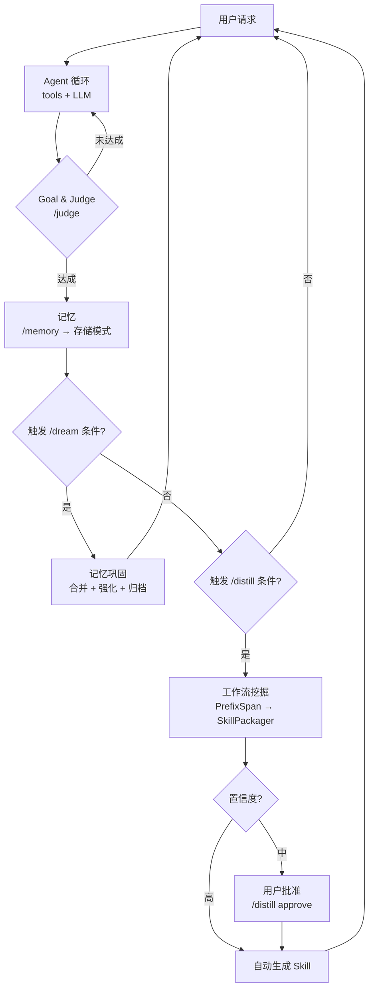

# Axiom

> 基于 **[CoreCoder](https://github.com/he-yufeng/CoreCoder)** 构建——Python 生态中最精简的 Claude Code 核心实现（~1,400 行）。
>
> Axiom 继承了 CoreCoder 干净的 agent 循环、工具系统、流式传输和上下文压缩，在此基础上层叠了 **五个认知子系统**，将其从教学产物转化为生产级的自主编程 Agent。

[English](README.md)

[](LICENSE)

**51万行 TypeScript → ~8,500 行 Python。**

CoreCoder 把 Claude Code 拆到了承重墙。Axiom 重建了上层——记忆、技能、代码分析、梦境巩固、目标裁判——构成一个**具备自我认知能力的编程 Agent 体系**。

这不是另一个 AI 编程工具。这是一份**蓝图**——自主编程 Agent 领域的 [nanoGPT](https://github.com/karpathy/nanoGPT)。读懂它，fork 它，然后造你自己的。

---

```
$ axiom -m kimi-k2.5

You > /analyze src/  # 查看复杂度热点

  > Analyzing src/...
  > Complexity hotspots:
  >   parse_config (src/config.py:42) complexity=12

You > /goal 把 parse_config 复杂度降到 8 以下，测试全过

  Goal set: 把 parse_config 复杂度降到 8 以下，测试全过
    1. parse_config 圈复杂度 < 8
    2. 所有现有测试通过
    3. 无新 lint 错误

You > /judge

  ✓ Goal met! (85% confidence)
    • Found 4 passed in 2.1s
    • parse_config complexity: 14 → 6
```

### 为什么叫 "Axiom"？

> **公理（Axiom）** 是不证自明的基本命题，是一切推理的起点。

这个项目正是如此——它是你构建自主编程 Agent 的**基础层**。从一个能跑的实现出发，然后朝你需要的方向自由扩展。

---

## 与 CoreCoder 的核心差异

CoreCoder 把 Claude Code 的 7 个核心架构模式浓缩到 ~1,400 行可读代码。Axiom 在此基础上扩展了 **5 个认知子系统**（~6,200行），把无状态的 Agent 循环变成了一个能自我进化的系统：

| 层级 | 系统 | 用途 | 代码量 |
|---|---|---|---|
| 🧠 **记忆** | `memory/`（5 文件） | 多层记忆——情节性、语义性、程序性 | 639 |
| 🔧 **技能** | `skills/`（6 文件） | 可插拔工具扩展——发现、加载、生成、校验 | 967 |
| 📐 **代码分析** | `code_analysis/`（7 文件） | AST 解析、调用图、复杂度指标、依赖图 | 2,063 |
| 🌙 **梦境蒸馏** | `dream_distill/`（5 文件） | 记忆巩固 + 工作流模式挖掘 → 自动技能生成 | 1,167 |
| 🎯 **目标裁判** | `goal/`（5 文件） | Actor-Critic 架构——设定目标，独立裁判评估 | 1,316 |
| **核心基础设施** | `tools/`, `agent.py` 等 | Agent 循环、并行执行、流式、压缩 | ~2,400 |

### 认知闭环

与简单的请求-响应 Agent 不同，Axiom 实现了一个**完整认知闭环**：



## 安装

```bash
pip install axiom
```

选你的模型，任何 OpenAI 兼容 API 都行：

```bash
# Kimi K2.5
export OPENAI_API_KEY=你的key OPENAI_BASE_URL=https://api.moonshot.ai/v1
axiom -m kimi-k2.5

# Claude（通过 OpenRouter）
export OPENAI_API_KEY=你的key OPENAI_BASE_URL=https://openrouter.ai/api/v1
axiom -m anthropic/claude-opus-4-6

# DeepSeek / Qwen / Ollama … 任何 OpenAI 兼容的 API
```

## 架构

```
axiom/
├── cli.py              REPL + 所有命令                 582 行
├── agent.py            Agent 循环 + 子系统              170 行
├── llm.py              流式客户端 + 重试                327 行
├── context.py          三层压缩                         196 行
├── session.py          会话保存/恢复                     90 行
├── prompt.py           系统提示词                        33 行
├── config.py           环境变量配置                      58 行
│
├── memory/             🧠 多层记忆系统
│   ├── models.py        MemoryItem, MemoryType           100 行
│   ├── manager.py       remember / recall / forget       235 行
│   ├── persistence.py   JSON 单文件存储                   124 行
│   └── search.py        TF 启发式语义搜索                 148 行
│
├── skills/             🔧 可插拔技能系统
│   ├── loader.py        从磁盘、pip、内置发现             187 行
│   ├── registry.py      内存注册表                         57 行
│   ├── manager.py       安装/删除/列出                    178 行
│   ├── generator.py     校验 + 模板生成                   266 行
│   ├── spec.py          数据模型                           24 行
│   └── builtin/         url_fetch, json_tool, file_stats 219 行
│
├── code_analysis/      📐 AST 静态代码分析
│   ├── ast_parser.py    函数/类/导入提取                  374 行
│   ├── call_graph.py    有向图、BFS 最短路径              197 行
│   ├── dependency_graph.py  模块依赖、环检测              308 行
│   ├── metrics.py       McCabe + 认知复杂度               349 行
│   ├── refactor.py      作用域感知重命名                   339 行
│   └── reporter.py      AnalysisResult、Markdown 报表     236 行
│
├── dream_distill/       🌙 记忆巩固 + 工作流挖掘
│   ├── dream.py         MemoryConsolidator, SmartForgetter 259 行
│   ├── distill.py       PatternMiner, PrefixSpan, SkillPkg 508 行
│   ├── schemas.py       DreamReport, WorkflowPattern       133 行
│   └── triggers.py      AutoTrigger（should_dream/distill）102 行
│
├── goal/               🎯 目标与裁判 (Actor-Critic)
│   ├── goal.py          GoalManager — 设定、精炼、追踪    226 行
│   ├── judge.py         Judge — 独立 LLM 裁判            394 行
│   ├── verifier.py      VerifierChain — 测试+文件+语法    338 行
│   └── schemas.py       Goal, JudgeVerdict, VerdictItem   148 行
│
├── tools/               🔧 Agent 工具实现
│   ├── analyze.py       AnalyzeTool（代码分析桥接）       266 行
│   ├── bash.py          Shell + 安全 + cd 追踪            115 行
│   ├── edit.py          搜索替换 + diff                    89 行
│   ├── read/write/glob/grep/agent  文件操作+子代理        269 行
│   └── base.py          Tool 基类                          27 行
│
│   总计                                                ~8,500 行
```

## 命令

```
通用:
  /help             显示帮助
  /reset            清空对话历史
  /model            查看当前模型
  /model <名称>     切换模型
  /tokens           查看 token 用量
  /compact          压缩上下文
  /save             保存会话
  /sessions         列出已保存会话
  /diff             查看本次修改的文件

认知:
  /memory           查看记忆统计
  /memory <查询>    搜索记忆
  /dream            运行记忆巩固
  /distill          挖掘并打包工作流技能
  /distill approve <名称>  批准中等置信度模式

分析:
  /analyze [路径]   AST 代码分析
  /skills           列出已加载的技能 & 工具

任务:
  /goal             查看当前目标
  /goal <描述>      设定完成目标
  /goal refine      分解为可检查的子条件
  /goal clear       清除当前目标
  /judge            评估目标是否真正达成

会话:
  quit              退出
```

## 当库用

```python
from axiom import Agent, LLM

llm = LLM(model="kimi-k2.5", api_key="your-key", base_url="https://api.moonshot.ai/v1")
agent = Agent(llm=llm)

# 所有子系统自动初始化：
#   agent.memory_manager  — 多层记忆
#   agent.dream_engine    — 巩固 + 蒸馏
#   agent.goal_engine     — 由 CLI 设置，用于 /goal 和 /judge

response = agent.chat("找出项目里所有 TODO 注释并列出来")
```

## 横向对比

| | Claude Code | CoreCoder | **Axiom** |
|---|---|---|---|
| 代码量 | 51万行（闭源） | ~1,400 行 | **~8,500 行** |
| Agent 循环 | ✅ | ✅ | ✅ |
| 上下文压缩 | ✅ | ✅ | ✅ |
| 并行工具执行 | ✅ | ✅ | ✅ |
| 持久化记忆 | ❌ 无状态 | ❌ | ✅ 多层 |
| 可插拔技能 | ✅ Skill 1.0 | ❌ | ✅ 发现+生成+校验 |
| AST 代码分析 | ❌ | ❌ | ✅ 调用图+复杂度+依赖 |
| 工作流蒸馏 | ❌ | ❌ | ✅ PrefixSpan → 自动技能 |
| 目标 & 裁判 | ❌ | ❌ | ✅ Actor-Critic |
| 能通读吗？ | 不能 | ✅ 容易 | ✅ 容易 |
| 适合 | 直接使用 | **理解原理** | **在此基础上构建** |

## License

MIT。Fork，学习，然后造更好的东西。

---

基于 **[CoreCoder](https://github.com/he-yufeng/CoreCoder)** 构建，作者 [何宇峰](https://github.com/he-yufeng) · Agentic AI Researcher @ Moonshot AI (Kimi)

Axiom 在 CoreCoder 的精简核心之上扩展了认知子系统——记忆巩固、工作流模式挖掘和自我评估。原始 Claude Code 逆向工程工作（51万 → 1,400 行）使这一切成为可能。衷心感谢 Claude Code 源码分析系列（[知乎 17 万阅读，6000 收藏](https://zhuanlan.zhihu.com/p/1898797658343862272)）打下的基础。
