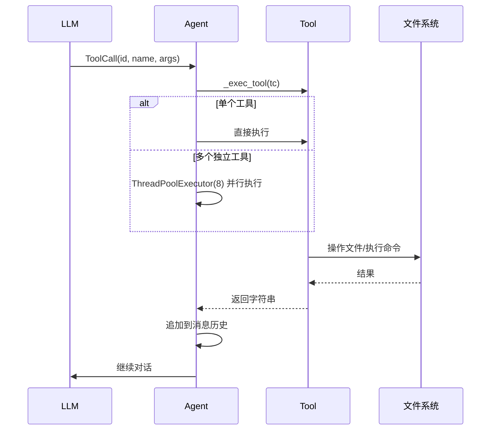

# 工具系统详解

工具层是 Axiom 与外部世界的接口，每个工具都是一个 `Tool` 子类，遵循统一的契约。

---

## 统一接口

所有工具继承自 `tools/base.py` 中定义的抽象基类：

```python
class Tool(ABC):
    name: str             # 工具名称
    description: str      # 工具描述
    parameters: dict      # JSON Schema 格式的参数定义
    
    @abstractmethod
    def execute(**kwargs) -> str:
        """执行工具逻辑，始终返回字符串"""
    
    def schema() -> dict:
        """返回 OpenAI 函数调用格式的 schema"""
```

所有工具在 `tools/__init__.py` 中被实例化并组装到 `ALL_TOOLS` 列表中。

---

## 10 个内置工具

### 1. `BashTool` — Shell 命令执行

| 项目 | 说明 |
|------|------|
| 文件 | `tools/bash.py` |
| 名称 | `bash` |
| 参数 | `command`（必填）、`timeout`（可选，默认 120 秒） |
| 返回值 | stdout + stderr + 退出码 |

**核心特性**：
- **工作目录追踪**：跨调用追踪 `cd` 命令，维护持续的工作目录状态
- **危险命令检测**：正则扫描 9 种危险模式（`rm -rf /`、`mkfs`、fork 炸弹、管道到 bash 等），命中即拦截
- **输出截断**：超过 15000 字符时，保留前 6000 + 后 3000 字符
- 使用 `subprocess.run` 执行

### 2. `ReadFileTool` — 文件读取

| 项目 | 说明 |
|------|------|
| 文件 | `tools/read.py` |
| 名称 | `read` |
| 参数 | `file_path`（必填）、`offset`（起始行，默认 1）、`limit`（读取行数，默认 2000） |
| 返回值 | 每行带行号的文本 |

**核心特性**：
- 行号以 `行号\t内容` 格式输出
- 支持偏移量和行数限制，便于分段读取大文件

### 3. `WriteFileTool` — 文件写入

| 项目 | 说明 |
|------|------|
| 文件 | `tools/write.py` |
| 名称 | `write` |
| 参数 | `file_path`（必填）、`content`（必填） |
| 返回值 | 写入确认信息 |

**核心特性**：
- 自动创建父目录
- 将文件路径记录到 `edit._changed_files` 集合中，供 `/diff` 命令追踪变更

### 4. `EditFileTool` — 搜索替换编辑

| 项目 | 说明 |
|------|------|
| 文件 | `tools/edit.py` |
| 名称 | `edit` |
| 参数 | `file_path`（必填）、`old_string`（必填）、`new_string`（必填） |
| 返回值 | 替换确认 + unified diff |

**核心特性**：
- 要求 `old_string` 在文件中恰好出现一次（零次报错并展示文件预览，多次报错要求更多上下文）
- 生成 unified diff 用于验证（最大 3000 字符）
- 维护 `_changed_files` 集合追踪本会话中所有修改过的文件

### 5. `GlobTool` — 文件搜索

| 项目 | 说明 |
|------|------|
| 文件 | `tools/glob_tool.py` |
| 名称 | `glob` |
| 参数 | `pattern`（必填，glob 模式如 `**/*.py`）、`path`（可选，默认当前目录） |
| 返回值 | 匹配的文件列表（按修改时间倒序） |

**核心特性**：
- 返回最多 100 个结果
- 超出时显示总数

### 6. `GrepTool` — 内容搜索

| 项目 | 说明 |
|------|------|
| 文件 | `tools/grep.py` |
| 名称 | `grep` |
| 参数 | `pattern`（正则表达式）、`path`（可选，默认当前目录）、`include`（glob 过滤，如 `*.py`） |
| 返回值 | 匹配行（带文件路径和行号） |

**核心特性**：
- 递归搜索，自动跳过 `.git`、`node_modules`、`__pycache__` 等目录
- 最多扫描 5000 个文件
- 最多返回 200 个匹配

### 7. `AnalyzeTool` — 代码结构分析

| 项目 | 说明 |
|------|------|
| 文件 | `tools/analyze.py` |
| 名称 | `analyze` |
| 参数 | `action`（7 种操作之一）、`path`（源码目录）、`symbol`（符号名）、`new_name`（新名称） |
| 返回值 | 格式化的分析结果文本 |

**7 种分析操作**：

| 操作 | 说明 |
|------|------|
| `function_list` | 列出所有函数/方法（按文件+行号排序），附复杂度信息 |
| `call_graph` | 调用者→被调用者边（最多 100 条）+ DOT 格式 |
| `complexity` | 按圈复杂度倒序排列的函数列表 + 热点标注 |
| `find_definition` | 查找符号定义位置（文件、行号范围、复杂度、依赖、docstring） |
| `find_usages` | 查找所有引用位置（调用、导入等） |
| `dependencies` | 模块依赖图 + 循环依赖检测 + DOT 格式 |
| `refactor_rename` | 安全重命名（干运行，含安全性评级、警告、影响文件列表） |

**缓存机制**：对每个目录路径缓存一次分析结果，避免重复解析。

### 8. `AgentTool` — 子代理生成

| 项目 | 说明 |
|------|------|
| 文件 | `tools/agent.py` |
| 名称 | `agent` |
| 参数 | `task`（必填，要委派的任务描述） |
| 返回值 | 子代理的执行结果 |

**核心特性**：
- 创建独立的 `Agent` 实例，共享父代理的 LLM 和全部工具（排除 `agent` 自身，防止递归）
- 最多 20 轮对话轮次
- 结果超过 5000 字符时截断至 4500
- 与 `agent.py` 双向依赖（惰性导入避免循环引用）

---

## 数据流：一次工具调用的生命周期



## 工具注册

在 `tools/__init__.py` 中：

```python
ALL_TOOLS = [
    BashTool(),
    ReadFileTool(),
    WriteFileTool(),
    EditFileTool(),
    GlobTool(),
    GrepTool(),
    AnalyzeTool(),
    AgentTool(),
]

def get_tool(name):
    """按名称查找工具实例"""
    for t in ALL_TOOLS:
        if t.name == name:
            return t
    return None
```

此外，还可通过**技能系统**（见 [技能系统](07-skills.md)）动态加载第三方工具。
