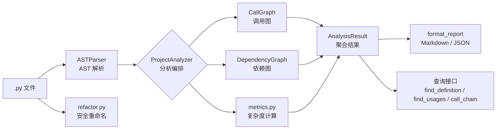

# 代码分析引擎

代码分析模块是 Axiom 对 Python 项目进行深度静态分析的核心，提供 AST 解析、调用图、依赖图、复杂度度量与安全重构五大能力。

---

## 架构概览



---

## 1. `ast_parser.py` — AST 解析引擎

**作用**：递归扫描项目中的所有 Python 文件，提取函数、类、导入的结构化元数据。

### 核心数据结构

```python
@dataclass
class FunctionInfo:
    name: str                    # 函数名
    qualified_name: str          # 限定名（如 Class.method）
    file: str                    # 源文件路径
    start_line: int              # 起始行
    end_line: int                # 结束行
    complexity: int              # 圈复杂度（由 metrics.py 填充）
    cognitive_complexity: int    # 认知复杂度（由 metrics.py 填充）
    dependencies: list[str]      # 内部函数调用列表
    called_by: list[str]         # 被谁调用（由 CallGraph 填充）
    docstring: str               # 文档字符串
    method: bool                 # 是否为方法
    class_name: str              # 所属类名

@dataclass
class ClassInfo:
    name: str           # 类名
    file: str           # 源文件
    start_line: int     # 起始行
    end_line: int       # 结束行
    bases: list[str]    # 基类列表
    methods: list[FunctionInfo]  # 方法列表
    docstring: str      # 文档字符串

@dataclass
class ImportInfo:
    module: str          # 模块名
    names: list[str]     # 导入的名称
    file: str            # 源文件
    line: int            # 行号
    is_from: bool        # 是否是 from X import Y 形式
```

### 核心类：`ASTParser`

| 方法 | 作用 |
|------|------|
| `parse_project(root)` | 递归扫描根目录下所有 `.py` 文件（跳过 `.git`、`__pycache__` 等），解析并聚合结果 |
| `parse_tree(tree, file)` | 遍历单个 AST 树，提取导入、类和顶层函数 |
| `parse_file(path, root)` | 解析单个 `.py` 文件 |
| `_extract_function(node, file, class_name)` | 从 AST 函数节点构建 `FunctionInfo`，包括提取函数调用名和 docstring |
| `_extract_class(node, file)` | 从 AST 类节点构建 `ClassInfo` |
| `_extract_call_names(node)` | 递归提取节点下的所有函数调用名（去重保序） |

---

## 2. `call_graph.py` — 调用图

**作用**：构建"谁调用谁"的有向图，支持最短调用链查询。

### 核心类：`CallGraph`

| 方法 | 作用 |
|------|------|
| `build(functions, classes)` | 注册所有函数的限定名为节点，根据 `FunctionInfo.dependencies` 建立边，回填 `FunctionInfo.called_by` |
| `shortest_path(from_func, to_func)` | BFS 查找最短调用链，返回有序列表或 `None` |
| `callers(func)` | 返回调用给定函数的所有函数（反向邻接） |
| `callees(func)` | 返回给定函数调用的所有函数（正向邻接） |
| `to_dot()` | 导出为 Graphviz DOT 格式 |
| `to_dict()` | 序列化为 JSON 兼容的字典 |

### 名称解析策略

`_resolve(dep, caller, all_names)` 尝试按优先序匹配：
1. 精确匹配
2. `Class.method` 后缀匹配
3. 按后缀的最终降级匹配

---

## 3. `dependency_graph.py` — 依赖图

**作用**：分析模块之间的导入关系，检测循环依赖，提供拓扑排序。

### 核心数据结构

```python
@dataclass
class ModuleInfo:
    dotted_name: str     # 模块点名（如 axiom.agent）
    file_path: str       # 文件路径
    imports: list[str]   # 导入的模块
    imported_by: list[str]  # 被哪些模块导入
```

### 核心类：`DependencyGraph`

| 方法 | 作用 |
|------|------|
| `build(root, imports)` | 扫描所有模块，根据 `ImportInfo` 建立仅有内部依赖的边 |
| `dependencies(module, transitive)` | 返回模块依赖（可选传递闭包） |
| `dependents(module, transitive)` | 返回依赖此模块的模块（可选传递闭包） |
| `find_cycles()` | DFS 循环检测，返回所有环的列表 |
| `topological_sort()` | Kahn 算法拓扑排序，存在环时返回 `None` |
| `to_dot()` / `to_dict()` | 格式导出 |

### 内部模块判定

`_is_internal(module)` 通过匹配已知的项目模块节点名来判断导入是否为内部模块。

---

## 4. `metrics.py` — 代码复杂度度量

**作用**：计算两种复杂度指标 —— McCabe 圈复杂度和 Sonar 风格的认知复杂度。

### 核心类

| 类 | 作用 |
|----|------|
| `ComplexityResult` | 包含 `name`、`cyclomatic`（最少 1）和 `cognitive` 的数据类 |
| `McCabeVisitor` | AST 访问者，统计决策点：`if`、`for`、`while`、`except`、`assert`、三元表达式、推导式、`BoolOp` |
| `CognitiveComplexityVisitor` | AST 访问者，实现 Sonar 认知复杂度规范，增加嵌套深度加分 |

### 圈复杂度（Cyclomatic Complexity）

统计以下结构的数量：
- `if` / `elif` / `for` / `while` / `except` / `assert`
- 三元表达式 (`IfExp`)
- 推导式（列表、字典、集合）
- 布尔操作符 (`and` / `or`)
- `async for` / `async with`

### 认知复杂度（Cognitive Complexity）

在圈复杂度基础上增加了：
- 嵌套深度加分
- `else` / `elif` 链的递增
- `break` / `continue` 计数
- 忽略 `match` / `case`（Python 3.10+）

---

## 5. `refactor.py` — 安全重命名

**作用**：在 AST 层面进行作用域感知的符号重命名，避免名称冲突。

### 核心数据结构

```python
enum RefactorSafety:
    SAFE       # 安全
    WARNING    # 有警告
    UNSAFE     # 不安全

@dataclass
class FileChange:
    file_path: str
    old_content: str
    new_content: str
    replacements: int  # 替换数量

@dataclass
class RefactorResult:
    old_name: str
    new_name: str
    safety: RefactorSafety
    changes: list[FileChange]
    warnings: list[str]
    def is_safe(): ...  # 属性
    def to_dict(): ...  # 序列化
```

### 核心函数：`refactor_rename(old_name, new_name, root, dry_run)`

**执行流程**：
1. 验证新名称合法性，检查是否覆盖内置函数（如 `len`、`print`）
2. 遍历所有 `.py` 文件
3. 对每个文件检查作用域冲突
4. 使用 `_NameRenamer` Transformer 执行 AST 级替换
5. 对 `Import`/`ImportFrom` 节点谨慎处理（跳过外部模块引用）

**降级机制**：当 Python < 3.9 导致 `ast.unparse` 不可用时，回退到基于正则表达式 `\b` 词边界的文本替换。

---

## 6. `reporter.py` — 报告生成

**作用**：聚合所有分析结果并格式化为可读报告。

### 核心类：`AnalysisResult`

```python
@dataclass
class AnalysisResult:
    root: str
    functions: list[FunctionInfo]
    classes: list[ClassInfo]
    imports: list[ImportInfo]
    call_graph: CallGraph
    dependency_graph: DependencyGraph
    
    # 计算属性
    total_functions: int
    total_classes: int
    total_files: int
    total_lines: int
    
    def complexity_hotspots(threshold): ...  # 圈复杂度热点
    def summary(): ...                       # 汇总统计
    def to_dict() / to_json(): ...           # 序列化
```

### 核心函数：`format_report(result, format)`

支持两种格式：
- **Markdown** — 带表格的易读报告：汇总表、复杂度热点表、函数列表、类列表、调用图边（Top 50）、依赖信息及循环警告
- **JSON** — 结构化数据输出

---

## 7. 顶层编排：`__init__.py` / `ProjectAnalyzer`

**作用**：将所有子模块串联成一个统一的 API。

### 核心类：`ProjectAnalyzer`

```python
class ProjectAnalyzer:
    def analyze(root) -> AnalysisResult:
        # 1. ASTParser.parse_project(root) → functions, classes, imports
        # 2. CallGraph.build(functions, classes)
        # 3. DependencyGraph.build(root, imports)
        # 4. 对每个函数调用 compute_complexity()
        # 5. 组装 AnalysisResult
    
    def find_definition(symbol) -> FunctionInfo | ClassInfo | None
    def find_usages(symbol) -> list[Definition]
    def call_chain(from_func, to_func) -> list[str] | None
    def refactor_rename(old_name, new_name, root, dry_run) -> RefactorResult
```

### 分析流程

```
parse_project()
    │
    ├──→ CallGraph.build()     ──→  enriched FunctionInfo
    ├──→ DependencyGraph.build()  ──→  ModuleInfo graph
    └──→ metrics.compute_complexity()  ──→  ComplexityResult
            │
            ▼
      AnalysisResult
```
