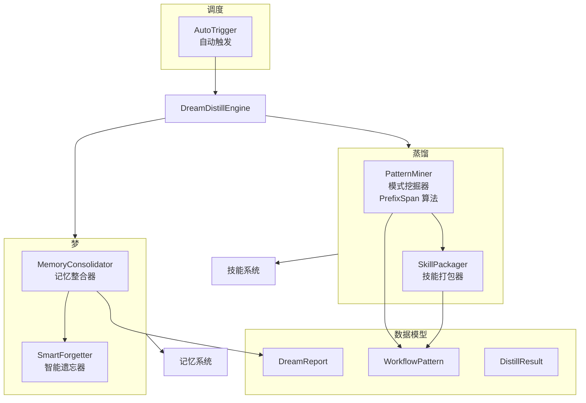

# 梦与蒸馏系统

**Dream & Distill** 模块受人类睡眠-清醒周期的启发，实现了一种自监督学习机制：

- **梦（Dream）** —— 像 REM 睡眠一样，整合记忆、解决矛盾、强化高频信息、归档陈旧信息
- **蒸馏（Distill）** —— 像清醒时的顿悟一样，从对话历史中挖掘高频工作流模式，并打包为可复用的技能

---

## 架构概览



---

## 1. `dream.py` — 梦：记忆整合

**作用**：模拟 REM 睡眠阶段的记忆巩固过程。

### `MemoryConsolidator` — 记忆整合器

执行 5 步梦循环：

| 步骤 | 方法 | 作用 |
|------|------|------|
| 1. 收集 | `consolidate(memory_manager)` | 从记忆系统获取最近 200 条记忆 |
| 2. 冲突检测 | `_find_conflicts(items)` | **调用 LLM** 识别相互矛盾的记忆对，解析 JSON 响应 |
| 3. 冲突合并 | `_merge_conflicts(...)` | 对每组冲突，选择"权威"条目（最新 / 最高置信度 / 最长内容），删除其余，权威条目置信度 +0.1 |
| 4. 强化 | `_strengthen(...)` | 访问次数 ≥ 3 的条目置信度 +0.05 |
| 5. 归档 | `_archive(...)` | 委托给 `SmartForgetter` 清除低价值记忆 |

### `SmartForgetter` — 智能遗忘器

使用公式计算每条记忆的保留价值：

```
保留分数 = 近期度 × 频率 × 置信度
```
其中：
- **近期度** = `1 / (1 + 距上次访问的天数)`
- **频率** = `log(1 + 访问次数)`
- **置信度** = 记忆的 `importance` 值

低于可配阈值的条目将被"遗忘"（从存储中删除）。

---

## 2. `distill.py` — 蒸馏：模式挖掘

**作用**：从对话历史中挖掘高频出现的工具调用序列，打包为可加载的技能。

### `PatternMiner` — 模式挖掘器

**核心算法：PrefixSpan（前缀投影序列模式挖掘）**

| 方法 | 作用 |
|------|------|
| `mine(sessions, memory_manager)` | 完整管道：提取 → 挖掘 → 转换 → 丰富 → 分置信度带 |
| `_extract_tool_sequences(sessions)` | 从会话字典中提取工具调用名序列 |
| `_enrich_with_llm(wp, steps_str)` | 使用 LLM 为模式赋予语义名称、适用上下文和候选类型 |

**置信度计算**：

```
置信度 = 频率比率 × sigmoid(模式长度) × 一致性 × 质量
```

模式被分为两个置信度带：
- **高置信度** — 直接打包为技能
- **中等置信度** — 供人工审核批准

### `SkillPackager` — 技能打包器

| 方法 | 作用 |
|------|------|
| `package(pattern, llm)` | 从模板生成技能 Python 代码（`Tool` 子类），写入 `~/.axiom/skills/{name}/` 目录 |
| `_default_body(pattern)` | 不使用 LLM 的 fallback 实现，循环执行各步骤 |
| `_generate_body_with_llm(pattern, llm)` | 请求 LLM 生成 `execute()` 方法体 |

**PrefixSpan 算法实现**：

```python
def prefixspan_mine(sequences, min_support, max_pattern_len):
    """返回按频率降序排列的频繁子序列"""
    
def _prefixspan_grow(prefix, projected, ..., frequent_patterns):
    """PrefixSpan 的递归增长步骤 — 构建投影数据库并计数"""
```

---

## 3. `triggers.py` — 自动触发

**作用**：决定何时自动执行梦或蒸馏，实现无人值守的自监督。

### `AutoTrigger` — 自动触发器

| 方法 | 作用 |
|------|------|
| `should_dream(memory_manager)` | 记忆数 > 50 **且**距上次梦 > 24 小时 |
| `should_distill(memory_manager)` | 工作流标记的记忆数 > 20 **且**距上次蒸馏 > 1 小时 |
| `mark_dreamed()` / `mark_distilled()` | 记录当前时间戳 |
| `to_dict()` / `from_dict()` | 状态序列化，支持跨重启持久化 |

---

## 4. `schemas.py` — 数据模型

```python
@dataclass
class DreamReport:
    new_items: int
    merged_items: int
    archived_items: int
    strengthened: int
    summary: str
    # Truthy 当有任何操作被执行

@dataclass
class WorkflowPattern:
    name: str                    # 模式名称
    steps: list[str]             # 步骤列表（工具调用序列）
    frequency: int               # 频率
    confidence: float            # 置信度
    contexts: list[str]          # 适用上下文
    avg_duration: float          # 平均耗时
    result_quality: float        # 结果质量评分
    candidate_type: str          # 候选类型

@dataclass
class DistillResult:
    patterns: list[WorkflowPattern]      # 所有模式
    high_confidence: list[WorkflowPattern]   # 高置信度
    medium_confidence: list[WorkflowPattern] # 中等置信度
    generated_skills: list[Path]         # 生成的技能文件路径
```

---

## 5. 顶层编排 — `DreamDistillEngine`

**文件**：`dream_distill/__init__.py`

| 方法 | 作用 |
|------|------|
| `dream()` | → `MemoryConsolidator.consolidate()` → `AutoTrigger.mark_dreamed()` |
| `distill()` | → `PatternMiner.mine()` → 高置信度模式经 `SkillPackager.package()` → `AutoTrigger.mark_distilled()` |
| `approve()` | 手动将中等置信度模式提升为高置信度并打包 |
