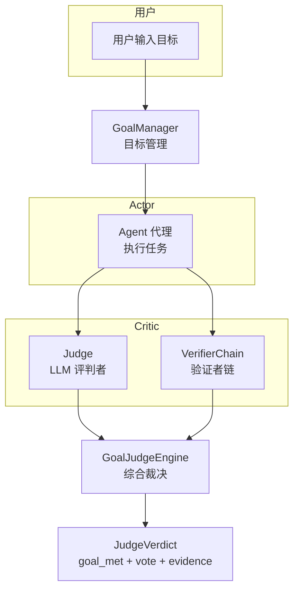
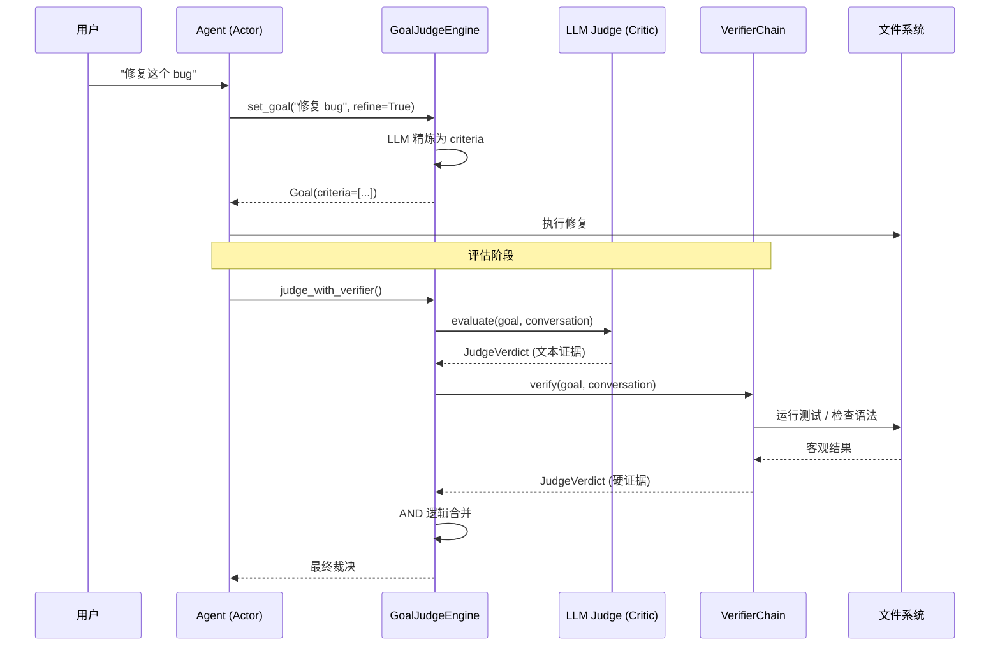

# 目标评判系统

**Goal** 模块实现了一种 **Actor-Critic（演员-评论家）** 架构 —— Actor（Agent）执行任务，Critic（Judge + VerifierChain）独立评估任务是否完成。

---

## 架构概览



---

## 1. `goal.py` — 目标管理器

### `GoalManager` — 目标生命周期管理

| 方法 | 作用 |
|------|------|
| `set_goal(input, refine)` | 接受字符串或 `Goal` 对象，若 `refine=True` 则调用 LLM 分解为可检查的子条件 |
| `refine_goal(goal)` | 使用 LLM 将模糊目标分解为结构化的 `criteria` 列表 |
| `_extract_criteria(description)` | 尝试 LLM 结构化提取，失败时回退到以换行/逗号/分号分割 |

**目标精炼提示词**：
- `_REFINE_PROMPT` — 要求 LLM 只返回 JSON 格式的判定条件
- `_CRITERIA_EXTRACTION_PROMPT` — 要求 LLM 从描述的文本中提取结构化判定条件

---

## 2. `judge.py` — LLM 评判者（Critic）

**作用**：独立的 LLM 评估者，使用与 Agent 不同的提示词（怀疑论者风格），基于客观证据评估，而非 Agent 的自我报告。

### `Judge` — 评判者

| 方法 | 作用 |
|------|------|
| `evaluate(goal, conversation)` | 主评估方法：格式化对话 → 调用 LLM（使用 `_JUDGE_SYSTEM_PROMPT`）→ 解析 JSON → 返回 `JudgeVerdict` |
| `evaluate_with_criteria(criterion, evidence)` | 基于给定证据评估单条标准 |
| `_parse_verdict(text)` | 从 LLM 回复中提取并验证 JSON |
| `_format_conversation(conversation)` | 将消息字典转为可读字符串，截断长工具结果 |
| `_evaluate_rule_based(goal, conversation)` | 无 LLM 时的回退方案：基于关键词匹配评分 |
| `_rule_based_criterion(criterion, evidence)` | 逐标准的启发式评估（测试关键词、错误关键词、通用关键字覆盖） |

**关键设计**：
- Judge 应使用**独立的 LLM 实例**（更低温度、不同模型），实现真正的 Actor-Critic 分离
- `strictness` 参数会缩放 LLM 的 `vote` 分数，使评判者更严格
- LLM 输出必须是 JSON，包含 `goal_met`、`vote`、`evidence`、`gaps`、`suggested_fix`、`items[]`

---

## 3. `verifier.py` — 验证者链

**作用**：运行**具体的、客观的检查**（测试执行、文件差异检查、语法验证），提供硬证据。

### `VerifierChain` — 验证者链

| 方法 | 作用 |
|------|------|
| `verify(goal, conversation)` | 遍历所有标准，分类后分派到各验证策略，聚合结果 |

**4 种验证策略**：

| 策略 | 方法 | 匹配条件 | 检查方式 |
|------|------|----------|----------|
| 测试 | `verify_tests()` | 含 `test`、`pytest`、`pass`、`fail` 等关键字 | 运行 `pytest` 子进程，检查退出码和输出 |
| 文件 | `verify_file_changes()` | 含文件相关关键字或 `.py` 扩展 | 扫描对话中 `"File written:"`、`"Created:"` 等模式，统计修改文件数 |
| 信息 | `verify_information()` | 含 `find`、`explain`、`what`、`how` 等 | 关键词覆盖率分析（≥60% 通过） |
| 语法 | `verify_syntax()` | 含 `syntax`、`lint`、`error`、`bug` 等 | 查找对话中提及的 Python 文件，调用 `compile()` 做语法检查 |

---

## 4. `schemas.py` — 数据模型

```python
@dataclass
class Goal:
    description: str        # 目标描述
    criteria: list[str]     # 可检查的子条件列表
    pinned: bool            # 是否固定（固定目标不会被精炼覆盖）
    created_at: str         # 创建时间
    metadata: dict          # 额外元数据
    # Truthy: 当 description 非空

@dataclass
class VerdictItem:
    criterion: str     # 评估的标准
    passed: bool       # 是否通过
    confidence: float  # 置信度
    evidence: str      # 证据
    gap: str           # 差距描述

@dataclass
class JudgeVerdict:
    goal_met: bool           # 目标是否达成
    vote: float              # 评分 (0~1)
    evidence: list[str]      # 证据列表
    gaps: list[str]          # 差距列表
    suggested_fix: str       # 建议修复
    items: list[VerdictItem] # 逐标准评估结果
    # Truthy: 仅当 goal_met=True 且 vote >= 0.5
```

---

## 5. 顶层编排 — `GoalJudgeEngine`

**文件**：`goal/__init__.py`

**构造要求**：需要两个独立的 LLM 实例 — `llm_agent`（用于目标精炼）和 `llm_judge`（用于评判），以保持 Actor-Critic 分离。

| 方法 | 作用 |
|------|------|
| `set_goal(input, refine)` | 设置新目标 |
| `refine_goal(goal)` | 精炼模糊目标 |
| `judge(goal, conversation)` | 仅运行 LLM 评判者 |
| `judge_with_verifier(goal, conversation)` | **同时运行** LLM Judge + VerifierChain，严格 AND 逻辑（两者都必须通过） |
| `summary()` | 返回当前目标摘要 |
| `clear()` | 清除当前目标 |

---

## Actor-Critic 数据流


