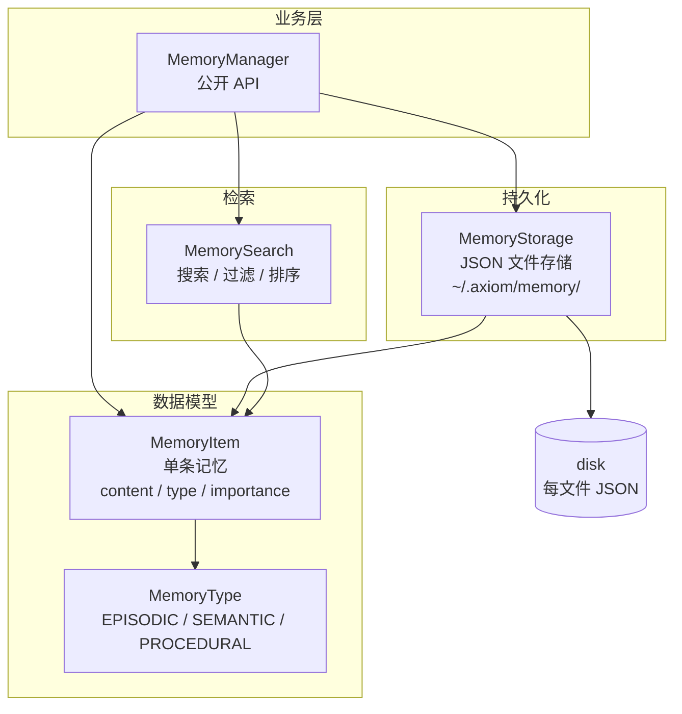
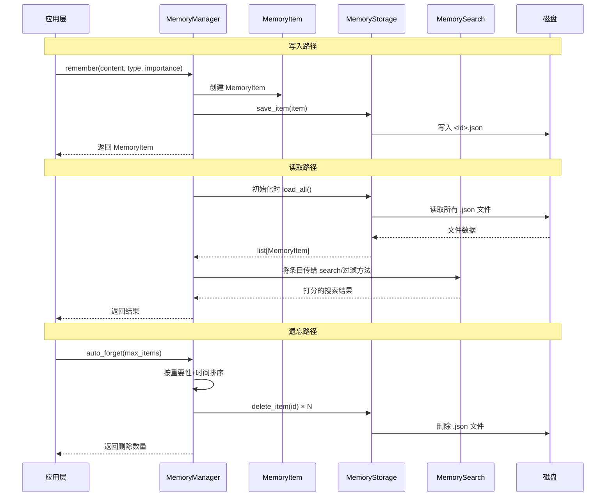

# 记忆系统

记忆系统是 Axiom 的长期存储层，受人类记忆模型启发，分为三层结构。每个记忆条目都是自包含的 JSON 文件，按 UUID 存储。

---

## 架构概览



---

## 1. `models.py` — 数据模型

### `MemoryType` — 记忆类型枚举

受人类记忆模型启发，分为三层：

| 类型 | 别名 | 含义 |
|------|------|------|
| `EPISODIC` | `CONVERSATION` | 情景记忆 — 原始对话记录 |
| `SEMANTIC` | `DECISION` | 语义记忆 — 提取的事实/决策/知识 |
| `PROCEDURAL` | `PATTERN` | 程序性记忆 — 可复用的工作流模式/技能 |

### `MemoryItem` — 记忆条目

```python
@dataclass
class MemoryItem:
    content: str              # 记忆内容
    type: MemoryType          # 记忆类型
    importance: float         # 重要性 (0.0 ~ 1.0)
    tags: list[str]           # 标签列表
    metadata: dict            # 额外元数据
    id: str                   # 自动生成的 UUID
    created_at: str           # ISO 格式创建时间
    access_count: int         # 访问次数
    last_accessed: str        # 最近访问时间
    confidence: float         # 置信度 (0.0 ~ 1.0)
    
    def age: float            # 属性：创建以来的秒数
    def is_expired(max_age):  # 是否超过最大存活期（默认 30 天）
    def to_dict():            # 序列化
    def from_dict(data):      # 反序列化
```

---

## 2. `persistence.py` — 持久化

**作用**：每个 `MemoryItem` 保存为独立的 JSON 文件，位于 `~/.axiom/memory/<id>.json`。这种设计支持手动检查和选择性读写，无需加载整个存储。

### `MemoryStorage` — 存储管理器

| 方法 | 作用 |
|------|------|
| `save_item(item)` | 写入单条记忆到 `<id>.json` |
| `load_item(item_id)` | 按 ID 读取单条记忆（缺失/损坏时返回 `None`） |
| `delete_item(item_id)` | 删除单个 JSON 文件 |
| `exists(item_id)` | 检查磁盘上是否存在 |
| `save_all(items)` | 全量同步：清空目录后写入所有条目 |
| `load_all()` | 读取目录下所有 JSON 文件，按文件名排序 |
| `clear()` | 删除所有 JSON 文件 |
| `export_json(path)` | 将所有记忆导出为单个 JSON 数组文件 |
| `import_json(path)` | 从 JSON 数组文件导入 |

---

## 3. `search.py` — 搜索与过滤

**作用**：零 LLM 依赖的高效检索，基于关键词打分。

### `MemorySearch` — 搜索器（纯静态方法）

| 方法 | 作用 |
|------|------|
| `by_type(items, types)` | 按类型过滤 |
| `by_tag(items, tag)` | 按单个标签过滤 |
| `by_tags(items, tags)` | 按多个标签（AND 逻辑）过滤 |
| `by_importance(items, min_imp, max_imp)` | 按重要性范围过滤 |
| `search(items, query, n, types)` | 主搜索方法：分词 → 打分 → 返回 Top-N |

### 打分启发式

| 匹配类型 | 每次匹配得分 |
|----------|-------------|
| 内容中精确短语匹配 | +3 |
| 标签中精确短语匹配 | +5 |
| 内容中单词匹配 | +1 |
| 标签中单词匹配 | +2 |

原始得分再乘以 `(0.5 + 0.5 × importance)` 以提升重要记忆的排名。零分条目被排除。

---

## 4. `manager.py` — 顶层管理器

**作用**：其他模块的公开 API，统筹持久化、检索和自动遗忘。

### `MemoryManager` — 记忆管理器

| 参数 | 默认值 | 说明 |
|------|--------|------|
| `storage_dir` | `~/.axiom/memory` | 存储目录 |
| `max_items` | `500` | 自动遗忘触发阈值 |

**公开 API**：

| 方法 | 作用 |
|------|------|
| `remember(content, type, importance, tags, metadata)` | 创建记忆 → 追加到内存列表 → 持久化到磁盘 → 返回条目 |
| `recall(query, n, types)` | 委托给 `MemorySearch.search()`，返回 Top-N 相关条目 |
| `get_recent(n, types)` | 返回最近 N 条新增的条目（可按类型筛选） |
| `get_by_type(type)` | 返回指定类型的所有条目 |
| `get_by_tag(tag)` | 返回指定标签的所有条目 |
| `get(item_id)` | 按 ID 查找单条目 |
| `forget(item_ids)` | 从内存和磁盘删除 → 返回删除数量 |
| `auto_forget(max_items, min_importance)` | 保留策略：超过上限时先移除低重要性条目，再移除最旧的 |
| `save()` | 强制全量磁盘同步 |
| `load()` | 从磁盘重新加载所有条目 |
| `clear()` | 删除所有记忆 |
| `count()` | 总条目数 |
| `summary()` | 返回统计摘要（总数、类型分布、平均重要性、存储路径） |

---

## 数据流


