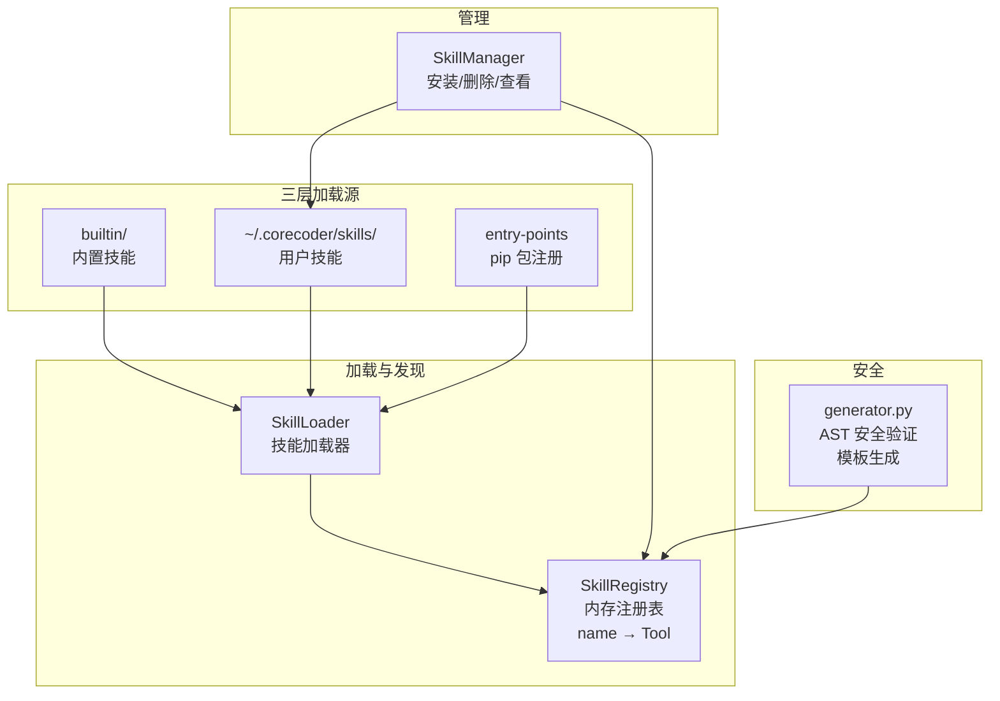
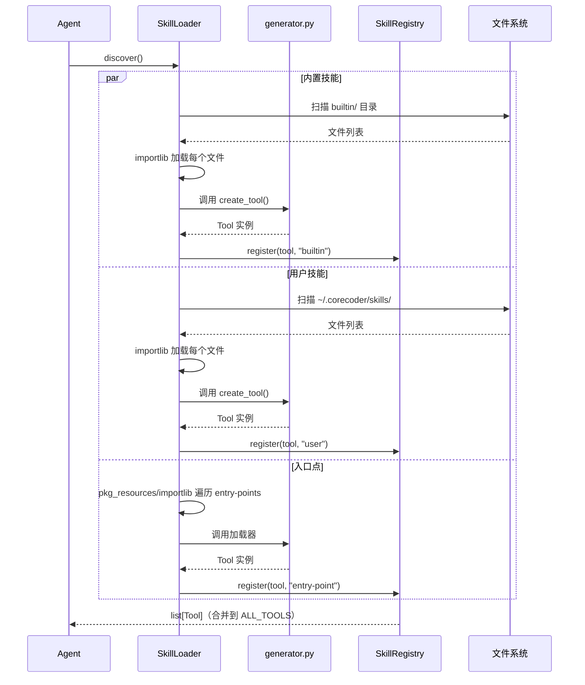

# 技能系统

**Skills** 模块实现了一套可插拔的工具扩展系统 —— 第三方开发者可以编写 Python 文件，通过简单的合约导出 `Tool` 子类，即可动态加载为 Agent 的新工具。

---

## 架构概览



---

## 1. `spec.py` — 数据模型与异常

```python
@dataclass
class ValidationResult:
    valid: bool          # 是否通过验证
    errors: list[str]    # 错误列表
    warnings: list[str]  # 警告列表

class SkillError(Exception): ...              # 技能相关异常的基类
class SkillNotFoundError(SkillError): ...     # 技能未找到
class SkillValidationError(SkillError): ...   # 技能验证失败
```

---

## 2. `loader.py` — 技能加载器

**作用**：从三个来源发现并加载技能。

### 加载源（按优先级排序，后加载可覆盖先加载）

| 来源 | 位置 | 说明 |
|------|------|------|
| **内置** | `skills/builtin/` | 随 Axiom 发布的官方技能 |
| **用户** | `~/.corecoder/skills/` | 用户自行安装或编写的技能 |
| **入口点** | pip 包的 `corecoder.skills` entry-points | 通过 pip 安装的第三方技能包 |

### `SkillLoader` 核心方法

| 方法 | 作用 |
|------|------|
| `discover()` | 从所有三个来源加载技能，返回 `list[Tool]` |
| `load_from_dir(directory)` | 扫描目录下的 `.py` 文件和子包，逐个加载并注册 |

### 加载合约

技能文件必须满足以下契约：
1. 定义一个继承自 `Tool` 的子类
2. 导出 `create_tool()` 工厂函数（返回 `Tool` 实例）

```python
# 示例技能文件
class MyTool(Tool):
    name = "my_tool"
    description = "Does something useful"
    parameters = {
        "type": "object",
        "properties": {
            "input": {"type": "string"}
        }
    }
    def execute(self, input: str) -> str:
        return f"Hello {input}"

def create_tool():
    return MyTool()
```

---

## 3. `registry.py` — 技能注册表

**作用**：内存中的 `name → Tool` 映射。

### `SkillRegistry` 核心方法

| 方法 | 作用 |
|------|------|
| `register(tool, source)` | 注册工具（名称冲突时覆盖并发出警告） |
| `unregister(name)` | 取消注册，返回是否存在 |
| `get(name)` | 按名称查找 |
| `list()` | 返回所有注册的工具 |
| `clear()` | 清空注册表 |

---

## 4. `manager.py` — 技能管理器

**作用**：文件系统级别的管理操作 —— 安装、删除、查看技能。

### `SkillManager` 核心方法

| 方法 | 作用 |
|------|------|
| `install_from_path(source)` | 将 `.py` 文件或目录复制到用户技能目录，然后加载注册 |
| `install_from_git(url, name)` | 克隆 Git 仓库到临时目录，找到技能候选，复制到用户技能目录，加载注册 |
| `remove(name)` | 从磁盘删除技能文件/目录，取消注册，清理 `__pycache__` |
| `list_installed()` | 返回用户技能目录中所有技能的元数据列表 |

---

## 5. `generator.py` — 验证与生成

**作用**：AST 级别的安全验证和技能模板代码生成。

### `validate_skill(skill_code, module_name)` — AST 安全验证

**四步验证管线**：

1. **语法解析** — 检查代码是否能被 Python 解析
2. **契约检查** — 确保文件导出了 `create_tool()` 函数
3. **安全扫描** — 遍历 AST 检查危险模式（**白名单+黑名单**双校验）

**被拦截的危险操作**：

| 类别 | 具体内容 |
|------|----------|
| 危险内置函数 | `eval`、`exec`、`compile`、`__import__` |
| 危险属性 | `remove`、`rmtree`、`system`、`chmod`、`unlink`、`delete` |
| 危险模块 | `ctypes`、`pickle`、`inspect`、`shelve`、`telnetlib`、`subprocess`（带 `shell=True`） |

4. **运行时验证** — 将代码写入临时文件，通过 `importlib` 实际导入并调用 `create_tool()`，检查返回值

### `generate_skill(name, description, properties, required, body)` — 模板生成

从模板生成完整的技能 `.py` 文件，包含 `Tool` 子类和 `create_tool()` 工厂函数。

---

## 6. 内置技能

Axiom 随附三个内置技能，位于 `skills/builtin/`：

### `FileStatsTool` （`file_stats.py`）

统计文件或目录的代码度量：行数、字符数、文件数、扩展名分布。可作为 `cloc`/`tokei` 的轻量替代。

### `JsonTool` （`json_tool.py`）

JSON 处理工具：格式化（漂亮打印）、验证、按键路径查询（如 `data.items[0].name`）。

### `UrlFetchTool` （`url_fetch.py`）

HTTP GET 请求工具，使用 `urllib.request`，返回最多 100KB 的文本内容。

---

## 数据流：技能加载全流程



---

## 关键设计决策

1. **三层加载 + 名称覆盖**：后加载的源可覆盖先加载的技能名，用户可覆盖内置行为
2. **仅 `create_tool()` 是合约**：无需注册装饰器或元类
3. **AST 验证先于导入**：在 `importlib` 加载前做安全检查，作为防御深度的一环
4. **`SkillManager` vs `SkillLoader`**：职责分离 —— Manager 负责文件系统 CRUD，Loader 负责只读发现与加载
