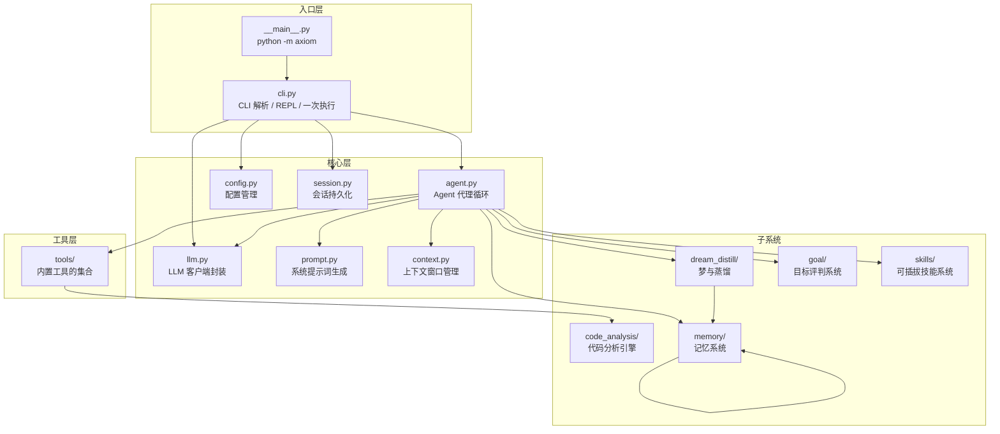
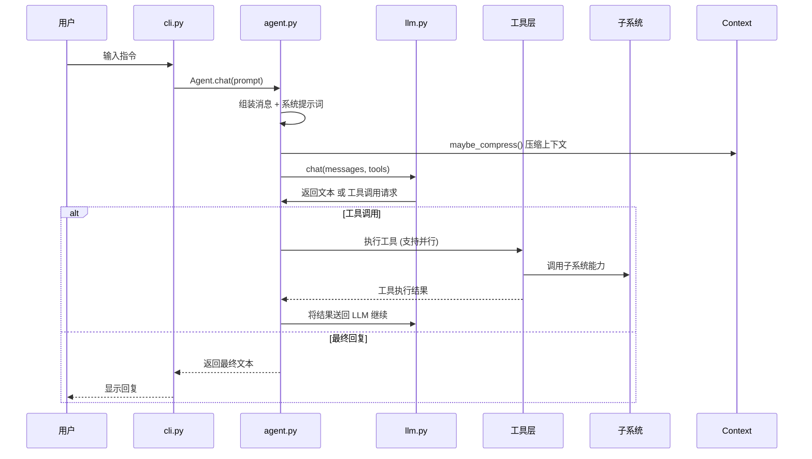

# Axiom — 智能编码助手架构文档

## 概述

**Axiom** 是一个基于大语言模型（LLM）的智能编码助手代理系统，其设计受 Claude Code 启发，采用 **Agent Loop (代理循环)** 架构 —— 用户输入自然语言指令，LLM 自主决定调用何种工具来完成任务，并在多轮交互中持续迭代。

---

## 架构全景图

---

## 模块一览

| 模块 | 路径 | 职责 |
|------|------|------|
| **入口** | `axiom/cli.py` + `__main__.py` | 命令行参数解析、REPL 交互、会话管理 |
| **核心** | `axiom/agent.py` | LLM 驱动的代理循环核心 |
| **LLM** | `axiom/llm.py` | 多供应商 LLM 客户端（OpenAI / LiteLLM） |
| **配置** | `axiom/config.py` | 环境变量驱动的配置加载 |
| **上下文** | `axiom/context.py` | 多层级上下文压缩，防止 token 溢出 |
| **提示词** | `axiom/prompt.py` | 系统提示词组装 |
| **会话** | `axiom/session.py` | 对话历史持久化（JSON 文件） |
| **工具** | `axiom/tools/` | 10 个内置工具（读/写/编辑/搜索/分析/子代理等） |
| **代码分析** | `axiom/code_analysis/` | AST 解析、调用图、依赖分析、复杂度度量、重构 |
| **记忆** | `axiom/memory/` | 三层记忆系统（情景/语义/程序性） |
| **梦与蒸馏** | `axiom/dream_distill/` | 记忆整合 + 工作流模式挖掘 |
| **目标** | `axiom/goal/` | Actor-Critic 目标评判系统 |
| **技能** | `axiom/skills/` | 可插拔工具扩展系统 |

---

## 数据流

---

## 下一步

请通过以下文档深入了解每个模块：

- [核心模块详解](01-core.md) — agent, cli, config, context, llm, prompt, session
- [工具系统详解](02-tools.md) — 10 个内置工具的设计与实现
- [代码分析引擎](03-code_analysis.md) — AST 解析、调用图、依赖图、复杂度度量、重构
- [梦与蒸馏系统](04-dream_distill.md) — 记忆整合与工作流模式挖掘
- [目标评判系统](05-goal.md) — Actor-Critic 目标的设定与验证
- [记忆系统](06-memory.md) — 三层记忆的持久化、搜索与自动遗忘
- [技能系统](07-skills.md) — 可插拔工具扩展架构
